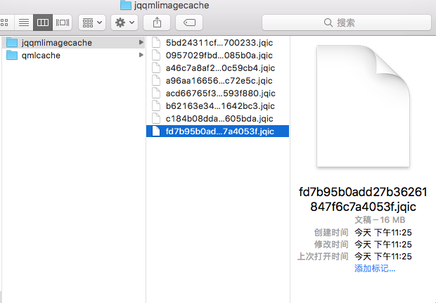
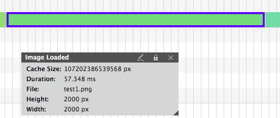
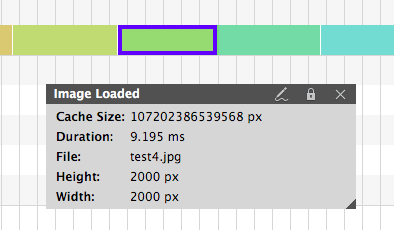
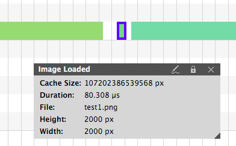

这是给QML开发的一个组件，用于代替QML中的Image控件，特点是加载快。

在我以往的开发中，尤其是嵌入式，图片的加载一直是一个头疼的问题。图片大了，加载就很慢，在嵌入式上，一个1280*1080的图片，加载可能要好几百毫秒。也就是说加载一个背景，就可能要花去几百毫秒，还不包括其他各种图片。
在用尽各种奇妙的方法后，今天终于找到一个根治的方法。赶紧来和大家分享下。

首先，我们要知道一个图片的加载，时间到底消耗在哪。

一般来说，一个图片加载，可以分为两步，第一步是从硬盘读取，这个根据设备的不同，差异会非常大。尤其是固态硬盘和机械硬盘，差个10倍都不夸张。第二部是将数据，比如说PNG数据解释为RGB数据（这里我暂时用解释这一词，如有更好请指正）。这一步会根据图片的复杂程度不同，带来不懂程度的开销。以我测试结果来看，对于一个普通的PNG图片，解释会占用大部分时间，大约是60%到90%的总时间开销。

也就是说，去掉解释的时间开销，是我们优化的大头。做这样简单的优化，我们就可以成倍提升图片的加载速度。那么如何优化呢，我的思路是这样的：

在第一次加载好图片后，就直接把解释好的RGBA数据保存到本地，以供下一次直接读取RGBA数据。

其实思路很简单，至于实现方法，我从模式上，直接照搬了qmlc那一套，就是在本地（硬盘中）的cache目录，保存缓存文件。而文件的命名，我使用了md5.jqic的模式，md5为（文件全路径）+（修改时间戳的字符串）的运算结果，jqic为JQImageCache的简称。保存效果如下：

当然这个有很显著的问题，就是图片被解释后，体积会非常大。如上截图中，我保存了一个2000*2000高宽，RGBA图片的缓存，这样保存出来就有16MB了。不过我觉得对于我们的PC，这个问题不大。毕竟缓存嘛，也是可以被清除的，这个可以靠库来维护。

注：那个qmlcache文件夹就是qmlc的缓存存储路径。大家都是缓存，咱们做邻居呗。

说了这么多，我们来看下效果，正常情况下，直接使用Image

大约58ms，才可以加载完这个PNG图片。那么使用我刚刚说的预解释的技术后：

整个加载只有9ms了，这基本就是在硬盘读取16MB数据的时间了。可见通过这简单的操作，我们就可以缩减75%的加载时间

怎么样，提升是不是很明显。但是除了上面提到的预解释，我们还可以预加载。

那么为什么要用预加载呢，因为程序在启动的时候，很多时候都是CPU高负载，硬盘基本没事情做。因为程序起来的时候，进入到main了，要读取的其实基本也读取完了，硬盘表示去休息了。

那我们当然不能允许硬盘休息了，利用程序在初始化模块的时间，我们可以也从硬盘去读取文件，先把RGBA数据读上来，要用了，直接拿来用。充分利用下设备性能。这样连硬盘读取都跳过了。那么这样能提升多少呢，我们来看下：

这样的话，大约缩减了99.8%的加载时间，也就是快了700倍，毕竟已经没什么事情可以做了，就是绑定了一个材质。当然这个数值，会随着图片变小而变小，图片变大而变大。我今天早些时间测试的时候可以测试出提速3000倍的图片。这是因为图片很大，而且数据较为复杂。

讲到这，原理就是这些，很简单，但是真的要做起来，会设计很多概念，比如说C++和QML交互，怎么缓存，等等，所以我干脆直接写了一个Demo，就是本GitHub

https://github.com/188080501/JQQmlImage

考虑到这个功能比较实用，这个库我基本会一直维护下去，包括增加新功能，例如图片自动预加载。希望有兴趣的朋友可以来个星星，谢谢。